# Fasten Connect Integration

## Goal

Replace manual FHIR/PDF uploads in the **pre-visit** phase with a one-click
"Connect your hospital" flow that pulls structured EHR records directly from
the patient's provider (Epic, Cerner, athenahealth, etc.) via Fasten Connect's
hosted API and Stitch web component.

## Status

Working end-to-end against the Epic sandbox. Records flow from MyChart-style
login -> Fasten Connect -> our webhook -> existing FHIR ingest pipeline ->
`HealthRecordDB`. All four downstream LLM tasks (pre-visit brief, Clinic
Companion, Therapy Guardian, adaptive check-in) automatically benefit because
they already read from `HealthRecordDB`.

## Why Fasten Connect (hosted SaaS) and not OnPrem

Two viable paths existed:

| Option | Tradeoff |
|--------|----------|
| **Fasten Connect** (hosted SaaS) | API + drop-in widget. No infra. PHI flows through Fasten servers (BAA required for prod). Costs money per connection. Test mode is free. |
| Fasten OnPrem (self-hosted Go binary) | Free, AGPL-3.0. Two services to run. Patient briefly sees Fasten UI during connect. |

We chose Connect to **validate the experience** before committing to
self-hosted infra or paying the AGPL licensing cost. Migration to OnPrem
later is feasible because the join point in our code is just a producer
of FHIR Bundles into the existing ingest pipeline.

## Architecture flow

The Stitch web component handles OAuth client-side. The backend never
mediates the user's hospital login -- it only receives webhooks and pulls
records once Fasten signals readiness.

Four lanes are involved:

- **Patient browser** -- Next.js frontend + embedded Stitch widget.
- **Our backend server** -- FastAPI at `localhost:8000`; only reachable
  from the public internet via the tunnel.
- **ngrok tunnel** -- public HTTPS URL (e.g.
  `<subdomain>.ngrok-free.app`) that forwards INBOUND traffic to
  `localhost:8000`. Required because Fasten's webhooks come from the
  public internet. Outbound calls from our backend to Fasten go direct
  over the public internet and do NOT pass through ngrok.
- **Fasten Connect** -- hosted SaaS.

```mermaid
sequenceDiagram
    autonumber
    participant B as Patient Browser
    participant S as Backend Server<br/>(localhost:8000)
    participant N as ngrok Tunnel<br/>(public HTTPS)
    participant F as Fasten Connect

    Note over B: Patient clicks "Connect your hospital"<br/>on /patient/records
    B->>F: Stitch widget loads from Fasten CDN,<br/>opens modal, redirects to hospital OAuth
    Note over B,F: Patient authenticates at hospital<br/>(Epic / Cerner / etc.) with portal credentials
    F-->>B: Hospital redirects back to Fasten&#59;<br/>widget emits widget.complete

    Note over F: Fasten now holds the EHR connection.<br/>Fires connection_success
    F->>N: POST /api/v1/fasten/webhook<br/>event: connection_success
    N->>S: forwards to localhost:8000

    B->>S: Frontend starts polling<br/>GET /v1/patient/records every 3s for 90s
    S->>F: POST /bridge/fhir/ehi-export<br/>{ org_connection_id }<br/>(outbound: direct, skips ngrok)
    F-->>S: returns task_id

    Note over S: Store {task_id: patient_id}<br/>in _TASK_TO_PATIENT (memory)
    Note over F: Async export runs (~10s - 1min)

    F->>N: POST /api/v1/fasten/webhook<br/>event: ehi_export_success<br/>with download_links[]
    N->>S: forwards to localhost:8000

    S->>F: GET download_links[i].url<br/>(outbound: direct, skips ngrok)
    F-->>S: 302 to signed S3 URL → NDJSON<br/>(one FHIR resource per line)

    Note over S: Parse NDJSON → FHIR Bundle<br/>→ ingest_fhir_json()<br/>→ HealthRecordDB<br/>→ emit HEALTH_RECORD_INGESTED

    S-->>B: Polling sees new records&#59;<br/>UI flips from "syncing..." to records list
```



**Rule of thumb for the ngrok lane:** ngrok is only in the path for
INBOUND webhooks (Fasten -> us). All OUTBOUND calls (us -> Fasten's
API, us -> signed S3 download URLs) leave the backend on the standard
egress route and never touch the tunnel.

## Components

### Backend

| Path | Purpose |
|------|---------|
| `crosscures_v2/api/fasten_webhook.py` | Webhook receiver. Routes by `event.type`. Holds in-memory `_TASK_TO_PATIENT` mapping. |
| `crosscures_v2/ingestion/fasten_client.py` | Outbound HTTP client for Fasten Connect. Basic auth, `request_ehi_export`, `get_export_status`, `download_export_file`. |
| `crosscures_v2/ingestion/service.py` | Unchanged -- existing `ingest_fhir_json()` is the integration entry point. |
| `crosscures_v2/config.py` | Reads `FASTEN_PUBLIC_ID`, `FASTEN_PRIVATE_KEY`, `FASTEN_API_BASE` from `.env`. `extra = "ignore"` so unrelated env vars (like frontend's `NEXT_PUBLIC_*`) don't crash settings. |
| `crosscures_v2/app.py` | Mounts the fasten webhook router. |

### Frontend

| Path | Purpose |
|------|---------|
| `crosscures_v2/frontend/components/FastenConnect.tsx` | Loads Fasten CDN (CSS + ES module JS). Renders `<fasten-stitch-element>` with patient's user.id as `external-id`. Listens for `eventBus`, updates status banner. |
| `crosscures_v2/frontend/app/patient/records/page.tsx` | Embeds `<FastenConnect>` above the legacy upload area. Polls records every 3s for 90s after `widget.complete`. |
| `crosscures_v2/frontend/app/callback/page.tsx` | Fallback landing page for Fasten's registered Redirect URL. Just redirects back to `/patient/records`. The widget is fully modal; this page is rarely hit in practice. |

## Setup checklist (new dev)

### 1. Fasten Connect account

- Sign up at https://connect.fastenhealth.com.
- Workspace > API Keys: copy the test-mode `public_id` and `private_key`.
- Workspace > Connections: enable **Epic Sandbox** in test mode.
- Workspace > Webhooks: create a webhook subscribed to these four events:
  - `connection_success`
  - `ehi_export_success`
  - `ehi_export_failed`
  - `webhook.test`
- Workspace > Redirect URL: set to `http://localhost:3000/callback`.

### 2. ngrok (or cloudflared) tunnel

The webhook URL must be publicly reachable. For local dev:

```bash
ngrok http 8000
```

Copy the HTTPS URL and set it as the Fasten webhook URL with path
`/api/v1/fasten/webhook` appended. Example:

```
https://abc-123.ngrok-free.app/api/v1/fasten/webhook
```

If you upgrade to ngrok's free reserved domain, the URL stays stable
across restarts and you only register it with Fasten once.

### 3. Backend `.env`

Add to `crosscures_v2/backend/.env`:

```
FASTEN_PUBLIC_ID=public_test_...
FASTEN_PRIVATE_KEY=private_test_...
FASTEN_API_BASE=https://api.connect.fastenhealth.com/v1
```

The `FASTEN_API_BASE` default in code matches this -- override only if
needed.

### 4. Frontend `.env.local`

Add to `crosscures_v2/frontend/.env.local`:

```
NEXT_PUBLIC_FASTEN_PUBLIC_ID=public_test_...
```

The `NEXT_PUBLIC_` prefix is required for Next.js to expose env vars to
client-side code. Same value as backend's `FASTEN_PUBLIC_ID`. Restart
`npm run dev` after adding (env changes need restart, not just hot
reload).

### 5. Run it

```bash
# Terminal 1
ngrok http 8000

# Terminal 2 (or use start.sh which does both)
cd crosscures_v2/backend && uv run uvicorn main:app --reload --port 8000

# Terminal 3
cd crosscures_v2/frontend && npm run dev
```

Confirm Fasten's dashboard webhook URL matches the current ngrok URL --
this is the most common foot-gun after restarting ngrok.

## Testing playbook

### Sanity: webhook reachability

In Fasten dashboard, find the webhook and click "Send test event."
Backend should log a `webhook.test` event and return 200.

### Path A: simulate a webhook locally (no browser)

Useful for iterating on handler logic without doing a full Epic login
each cycle.

```bash
curl -X POST http://localhost:8000/api/v1/fasten/webhook \
  -H "Content-Type: application/json" \
  -d '{
    "type": "connection_success",
    "data": {
      "org_connection_id": "any-uuid-here",
      "external_id": "<a real patient UUID from your DB>"
    }
  }'
```

The Fasten outbound call will fail with 5xx (no such connection in Fasten)
but auth and routing are verifiable from the backend logs.

### Path B: real Epic sandbox connect

1. Open http://localhost:3000, log in as a patient (demo seed creates
   `patient@demo.com` / `demo1234`).
2. Go to Records.
3. Click "Connect your hospital."
4. Search "Epic Sandbox" in the widget.
5. Log in with one of the Epic test patients:
   - `FHIRTWO` / `EpicFhir11!`
   - `fhirderrick` / `epicepic1`
   - `fhirnancy` / `epicepic1`
   - `fhircamila` / `epicepic1` (note: see "Known issues" below)
6. Authorize.
7. Watch backend logs for the two webhook events. Total elapsed time:
   `connection_success` is immediate; `ehi_export_success` is 30s-90s
   later depending on patient data volume.
8. Records appear in the UI within ~3s of `ehi_export_success` (frontend
   is polling).

## Known issues / lessons learned

### `fhircamila` triggers `resource_patient_failure`

Fasten's EHI export against Epic sandbox patient `fhircamila` fails with
`failure_reason: resource_patient_failure`. Per Fasten's docs: "An error
occurred while trying to fetch a patient resource. This is unusual
because the token (likely) refreshed successfully." Other Epic sandbox
test patients work. This is a Fasten-Epic interaction quirk, not an
integration bug.

### `connection_success` server event vs `patient.connection_success` widget event

Server-side webhook payload's `type` field uses the `patient.` prefix
(e.g., `"patient.connection_success"`). The Stitch web component's
client-side `eventBus` events also use the prefix. We normalize by
stripping `patient.` in both the backend webhook handler and the
frontend event handler so downstream code matches on bare event names.

### NDJSON not Bundle

Fasten's EHI export download is **NDJSON** (one FHIR resource per line),
not a single FHIR Bundle. We wrap the parsed resources into a
synthetic Bundle in the webhook handler so we can pass it to the
existing `ingest_fhir_json()` without modifying that function.

### Public ID env var must live in the frontend `.env.local`, not backend `.env`

The frontend reads `NEXT_PUBLIC_FASTEN_PUBLIC_ID` from
`frontend/.env.local`. Pydantic Settings on the backend rejects unknown
env vars by default and will crash on startup if the var is in the
backend `.env` instead. We mitigated by setting `extra = "ignore"` in
`Settings.Config`, so backend now tolerates stray vars -- but the right
place for frontend env vars is still `frontend/.env.local`.

### ngrok free-tier URLs change on restart

The webhook URL in the Fasten dashboard becomes stale every time you
restart `ngrok http 8000`. Either reserve a free static ngrok domain
(takes 5 min in ngrok dashboard) or update the Fasten webhook URL each
session.

### `widget.complete` fires regardless of EHI export outcome

The frontend polls for new records on `widget.complete`. If the EHI
export later fails (e.g., `resource_patient_failure`), the polling
finishes silently with no records found. Surfacing the failure to the
UI is a TODO -- see below.

## Not yet implemented / TODOs

Roughly ordered by priority for taking this past demo:

1. **Persist `task_id -> patient_id` mapping in DB** (currently
   `_TASK_TO_PATIENT` is an in-memory dict in `fasten_webhook.py`).
   Restarts lose the mapping. Add an `EHRConnectionDB` table with
   `(patient_id, org_connection_id, task_id, vendor, tenant, status,
   last_synced_at)` and look up there instead. This is also what powers
   a "Connected to Stanford Health" badge in the UI and a "Refresh
   records" button.
2. **Surface `ehi_export_failed` to the frontend.** Either a status
   endpoint the frontend polls alongside records, or a WebSocket push.
   Today the user sees "Importing records..." silently fall back to the
   prior state if the export fails server-side.
3. **Webhook signature verification.** Fasten sends `webhook-signature`
   and `webhook-timestamp` headers. We log them but don't verify. For
   production this is required.
4. **Multiple connections per patient.** Code path is fine but UX
   doesn't yet show a list of connected providers or let the user
   reconnect a specific one.
5. **Periodic refresh.** Today this is a one-shot pull on connect. For
   Stage 3 (Therapy Guardian) value we want a daily background sync of
   new labs/meds. Use `POST /bridge/fhir/ehi-export` on a schedule.
6. **Process other download_links file types.** We currently treat all
   `download_links[].url` entries as NDJSON. Fasten can return other
   `export_type` values (e.g., CCDA XML for TEFCA-mode connections). Add
   branching by `export_type` / `content_type`.
7. **Move Stitch CDN load out of the FastenConnect component.**
   `useEffect`-injected `<link>` and `<script>` work but pollutes
   document head on every component mount. Better to load via Next.js
   `<Script>` at layout level.

## References

- Fasten Connect docs: https://docs.connect.fastenhealth.com
- Stitch web component: https://docs.connect.fastenhealth.com/stitch/v4/sdks/web-component/reference.md
- Stitch client events: https://docs.connect.fastenhealth.com/stitch/v4/client-events
- Webhook events: https://docs.connect.fastenhealth.com/webhooks/events.md
- Epic sandbox test patients: https://fhir.epic.com/Documentation?docId=testpatients
- OpenAPI spec: https://docs.connect.fastenhealth.com/api-reference/openapi.yaml
